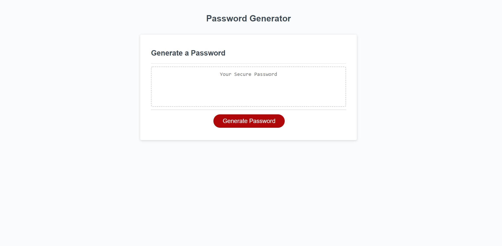
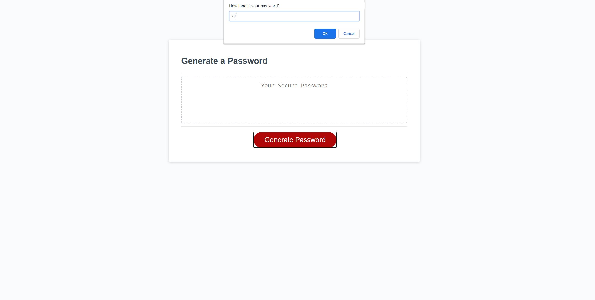
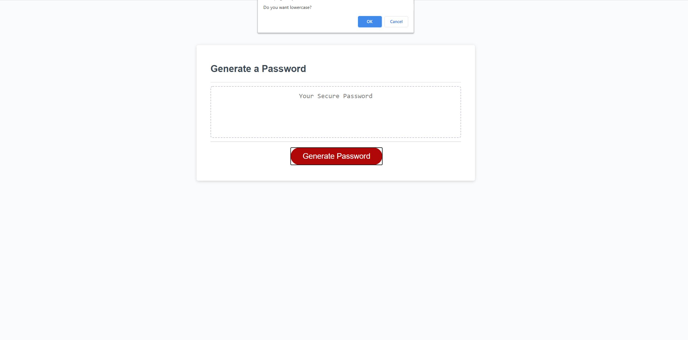
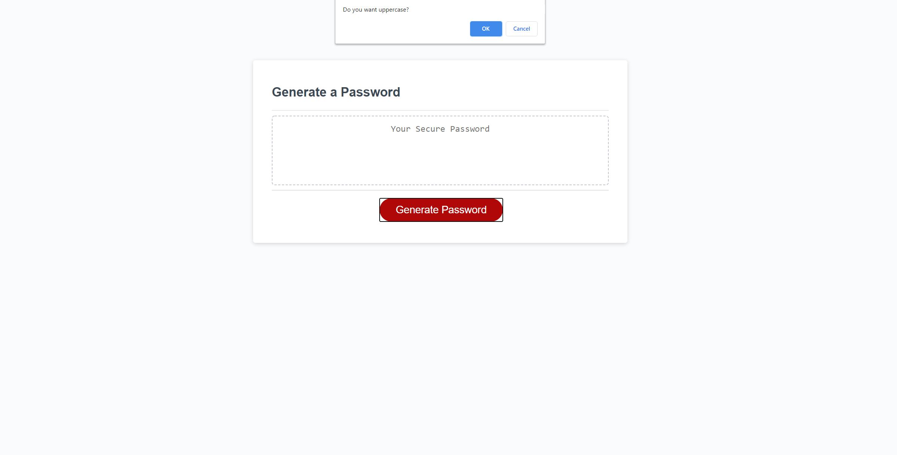
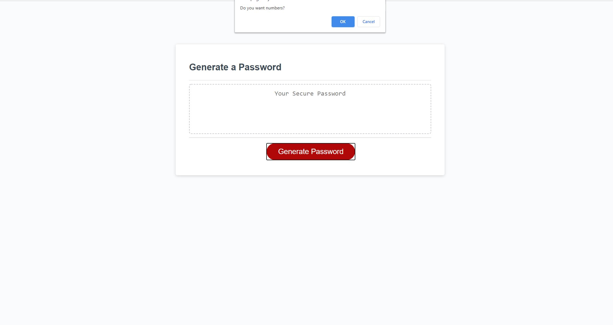
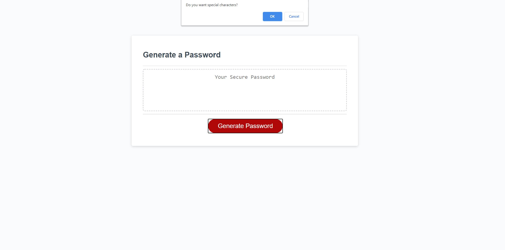
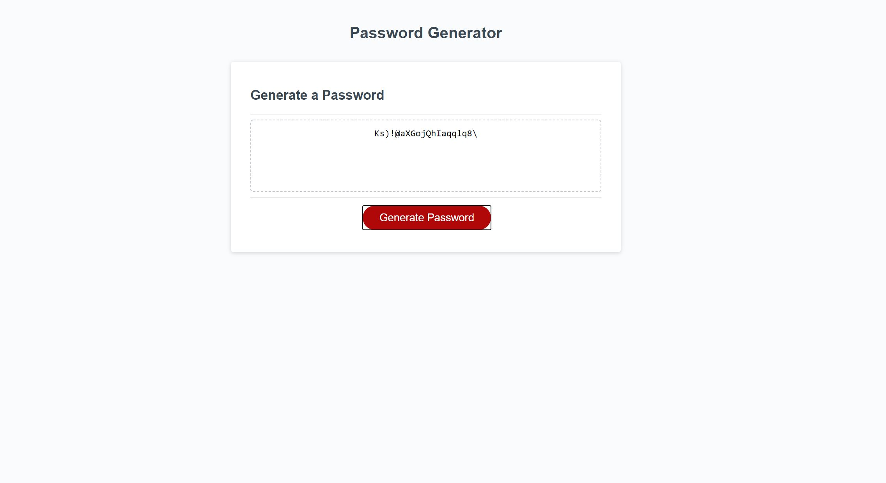

# Javascript-Password-Generator

## Project Description
For this project I wanted to create a random password generator. The criteria for the generator was for the user to choose a password between 8-128 characters that included lowercase, uppercase, numbers, and special characters. The user could choose which of these four characters they wanted, and the generator would respond accordingly.

## Process

My first job was to identify all of my variables. I started with arrays made of lowercase letters, uppercase letters, numbers, and special characters. I also made two variables for password max length and password minimum length. 

Initially I started changing the HTML to add checkboxes the user would click to choose which characters they wanted. My tutor than informed me I was making this assignment way more difficult. After that revelation I was able to just focus on the javascript and use the HTML provided.

My script works first by prompting the user how long they would like their password. If the length follows according to the parameter of 8-128 then it asks for what characters they wish to include. If they choose a selected character that is then concatenated onto a blank array called allChosenChar. That array is then put through my randomizer function that incrementally adds characters to the password until it reaches the length prompted by the user.

Overall, I had a tough time with this assignment, but the help from my tutors, TAs and my peers really helped me understand the concept from what I was trying to build. If I could do the process again I would pseudocode out every step with notes first. I did that with my tutor after I had already started and it helped immensely. 

After getting the function to work I had some details I needed to add. I used toNAN to make sure if the user puts a letter in the prompt, it corrects the user and goes back to the beginning. I also had to fix the special characters and use the ones provided in the assignment.

## Project Link
[Deployed Link](https://mikecoletta.github.io/Javascript-Password-Generator/)

## Site Screenshot

## Credits
[list of Password Special Characters from the OWASP Foundation](https://www.owasp.org/index.php/Password_special_characters)
